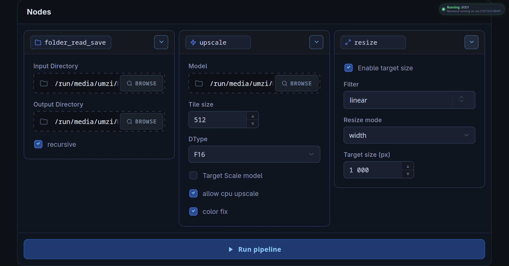

# EasyReLine

Простая open-source обёртка над [ReLine](https://github.com/rewaifu/reline) с минимальным, но достаточным функционалом для удобного апскейла изображений.



---

## Функционал

### 1. Нода **Folder Read & Save**

Принимает:

* **Input Directory** — путь к папке, откуда берутся изображения для апскейла
* **Output Directory** — путь к папке для сохранения результата
* **Recursive** — флаг рекурсивного чтения

Если включена рекурсия, структура вложенных папок полностью сохраняется в директории назначения.

---

### 2. Нода **Upscale**

Основная нода обработки изображения.

* **Model** — путь к модели.
  Поддерживаются веса большинства популярных архитектур.
  Форматы: `safetensors`, `pth`, `pt`.
  Если модель не поддерживается — напишите в [Discord](https://discord.gg/hEgdaVzTs9)

* **Tile Size** — размер плитки, на которую разбивается изображение.
  Если размер плитки больше изображения, разбиение не выполняется.
  Тайлинг снижает потребление памяти, так как вычислительные затраты растут квадратично с увеличением размера изображения.
  Без тайлинга большие изображения могут привести к OOM.
  Рекомендуется выставлять максимально возможный размер плитки, который помещается в видеопамять.
  Следует учитывать, что тайлинг может незначительно снижать качество.

* **DType** — тип данных для обработки изображения.
  Если вы не уверены в выборе, используйте `F32`.

* **Target Scale Model** — итоговый коэффициент масштабирования.
  Для моделей 1x увеличение недоступно — будет ошибка.
  Можно указывать дробные значения, например `3/4` — пайплайн корректно применит масштаб.
  Поддерживается как увеличение, так и уменьшение.

* **Allow CPU Upscale** — если отключено и активны только CPU-драйверы, обработка не начнётся.

* **Color Fix** — лёгкая коррекция уровней изображения для смягчения артефактов модели.
  Рекомендуется не отключать. На яркость изображения не влияет.

---

### 3. Нода **Resize**

Дополнительная финальная обработка.

* **Enable Target Scale** — если включено, изображение в конце пайплайна ресайзится до заданного размера выбранным фильтром.

* **Filter** — метод интерполяции.
  Все варианты, начинающиеся с `s` и содержащие число в конце, относятся к [SuperSampling](https://docs.rs/fast_image_resize/latest/fast_image_resize/enum.ResizeAlg.html#variant.SuperSampling)
  Наиболее стабильный вариант — `linear`.

* **Resize Mode** — определяет, какая сторона будет приведена к `Target Size` с сохранением пропорций.
  Например: если выбрана ширина 1000, а изображение после апскейла имеет размер 1500×2000 (H×W), итоговый размер станет 750×1000.

* **Target Size** — целевой размер выбранной стороны.

---

## Установка

### Linux

1. Скачайте из Releases архив `easy_reline-vx.x.x-x86_64-linux.tar.gz`
2. Распакуйте в удобную директорию
3. Выдайте права на запуск:

   ```bash
   chmod +x easy_reline
   ```
4. Запустите:

   ```bash
   ./easy_reline
   ```

Первый запуск может занять до часа, так как рядом с бинарным файлом устанавливается PyTorch.

Для пользователей Wayland запуск:

```bash
WEBKIT_DISABLE_COMPOSITING_MODE=1 GDK_BACKEND=x11 ./easy_reline
```

---

### Windows

1. Скачайте из Releases:

   * `easy_reline_x.x.x_x64_en-US.msi`
     или
   * `easy_reline_x.x.x_x64-setup.exe`
2. Установите программу в удобную директорию

Первый запуск также может занять до часа из-за установки PyTorch.

---

## Ручная сборка

```bash
git clone https://github.com/rewaifu/easy_reline.git
cd easy_reline

# Windows
cargo tauri build

# Linux
cargo tauri build --no-bundle
```
